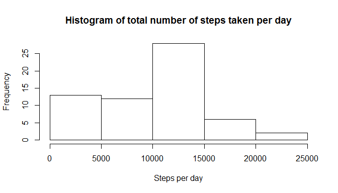
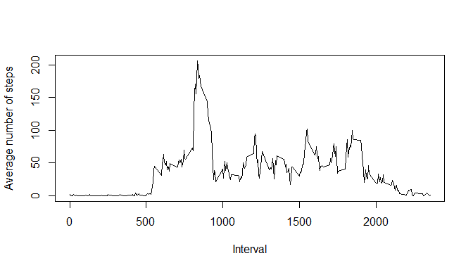
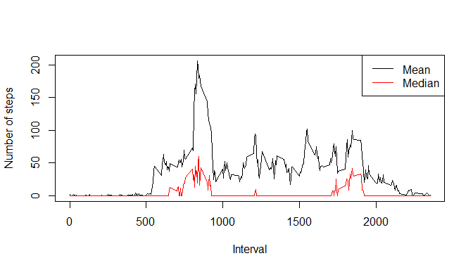
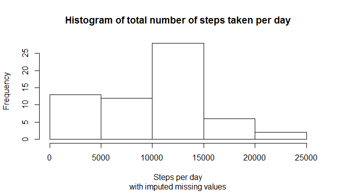
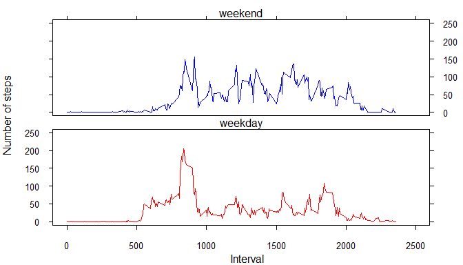

# Reproducible Research: Peer Assessment 1


## Loading and preprocessing the data
The following code download the data from the provided link and load it into a data frame named *activity*. 


```r
## Download & read data 
setInternet2(use=T)
fileUrl <- paste("https://d396qusza40orc.cloudfront.net/",
                 "repdata%2Fdata%2Factivity.zip", sep="")
#data <- getURL(fileUrl, ssl.verifypeer=0L, followlocation=1L)  
temp <- tempfile()
download.file(fileUrl, temp)
activity <- read.csv(unz(temp, "activity.csv"), head=T)
```

## What is mean total number of steps taken per day?
I wrote a function to  

1. Calculate the total number of steps taken per day  

2. Draw a histogram of the total number of steps taken per day  

3. Calculate the mean and the median of the total number of steps across all days. 

The histogram is displayed as the function is called:

```r
dailyStepHist <- function(x, subtit="") {
    sum <-  sapply(unique(x$date), function(day) {
                    sum(x$step[x$date==day], na.rm=T)})
    hist(sum, main="Histogram of total number of steps taken per day",
         sub=subtit, xlab="Steps per day")
    c(Mean = mean(sum, na.rm=T), Median=median(sum, na.rm=T))
}
totalSteps <- dailyStepHist(activity)
```

 

The function returns the mean & median of the total number of steps taken per day:

```r
totalSteps
```

    Mean   Median 
 9354.23 10395.00 

## What is the average daily activity pattern?
Here is the pattern of the average daily activity, calculated as the average number of steps taken during each 5-minute interval across all days:


```r
interval <- data.frame(id = unique(activity$interval))
interval$step <- sapply(interval$id, function(int) {
                    mean(activity$step[activity$interval==int], na.rm=T)})
with(interval, plot(id, step, type="l", 
                    xlab="Interval", ylab="Average number of steps"))
```

 

The identifier of the 5-minute interval that has the maximum number of steps is 835


```r
interval$id[which.max(interval$step)]
```

[1] 835

## Imputing missing values
The number of missing values in the data is 2304

```r
sum(is.na(activity$step)) 
```

[1] 2304

The graph below suggests the mean tends to overestimate the number of steps taken during each interval (the mean is higher than the median):

```r
interval$med <- sapply(interval$id, function(int) {
    median(activity$step[activity$interval==int], na.rm=T)})
plot(interval$id, interval$step, type="l",
     xlab="Interval", ylab="Number of steps")
lines(interval$id, interval$med, type="l", col ="red")
legend("topright", col=c("black", "red"),
       legend=c("Mean", "Median"),lty=1)
```

 

Therefore, I replace the missing values using the median of the number of steps taken during each interval across all days. I reuse the function `dailyStepHist` to draw a histogram of the new dataset (after imputing missing values):


```r
newact <- activity
newact <- merge(newact, interval[,c("id", "med")], by.x="interval", by.y="id")
newact$steps[is.na(newact$step)] <- newact$med[is.na(newact$step)]
newTotalSteps <- dailyStepHist(newact, subtit="with imputed missing values")
```

 

It is not obvious that the two histograms differ, but the statistics have changed after imputing missing data:


```r
totalSteps <- rbind(totalSteps, newTotalSteps)
rownames(totalSteps) = c("Original data", "With imputed values")
kable(totalSteps)
```

                           Mean   Median
--------------------  ---------  -------
Original data          9354.230    10395
With imputed values    9503.869    10395

Since the median was used to field the missing values, the median does not change after compared to that of the original data. The mean increases since the missing data are replaced by non-negative values. 

## Are there differences in activity patterns between weekdays and weekends?
A new factor variable is created (`dow` - day of week) to note whether the day is "weekday" or "weekend" day.


```r
newact$dow <- as.factor(ifelse(as.POSIXlt(newact$date)$wday %in% 1:5,
                               "weekday", "weekend")) 
```

Here is the R code that computes the average number of steps taken during 5-minute intervals across all weekday and weekend days:


```r
interval$wkmean <- sapply(interval$id, function(int) {
    mean(newact$steps[newact$interval==int & as.character(newact$dow)=="weekend"])})
interval$wdmean <- sapply(interval$id, function(int) {
    mean(newact$steps[newact$interval==int & as.character(newact$dow)=="weekday"])})
```

Panel plot of the time series of the average number of steps taken during 5-minute intervals on weekday and weekend days: 


```r
par(mfrow=c(2,1),
    mar = c(0,1,1,2),
    oma = c(3,3,0.5,0.5),
    cex.axis=0.8,
    tcl=-0.3,
    las = 1
)
plot(interval$id, interval$wkmean, type="l", col="blue", axes=F,
     xlim = c(0, 2500), ylim = c(0, 250))
    axis(2, labels=F) # left axis
    axis(3, labels=F) # top axis
    axis(4, labels=T) # right axis
    box()
     mtext("weekend")
plot(interval$id, interval$wdmean, type="l", col="red", axes=F,
     xlim = c(0, 2500), ylim = c(0, 250))
     axis(1, labels=T) # bottom axis
     axis(2, labels=T) # left axis
     axis(4, labels=F) # right axis
     mtext("weekday")
    box()
mtext("Interval", side = 1, outer=T, line=2)
mtext("Number of steps", side=2, outer=T, las=0, line=2)
```

 

The patterns differ for weekdays vs. weekends. There are spikes during the intervals 800s and 1800s (commutes?) of the weekdays, which are not observed during the weekends. Subjects tend to move more during other non-sleeping hours on weekends compared to the weekdays. 
